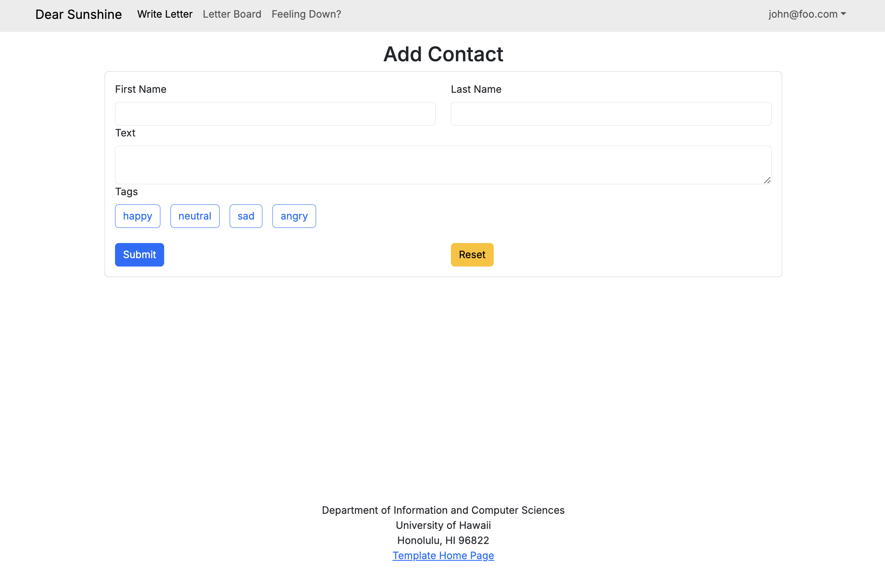
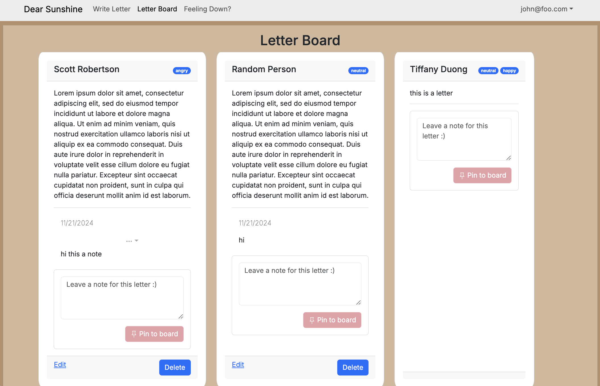
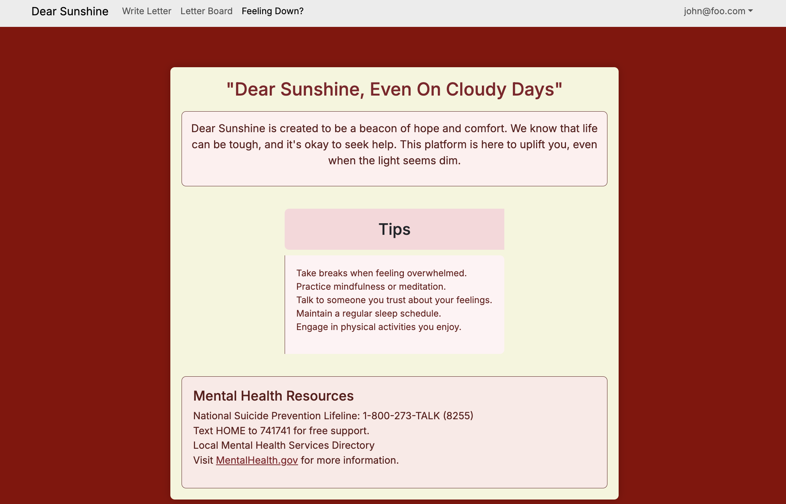

## Dear Sunshine
* [Overview](#overview)
* [Project Mockups](#project-mockups)
* [Up to Date Screenshots](#up-to-date-screenshots)
* [Project Milestones](#project-milestones)
* [Developer Guide](#developer-guide)
* [Deployment](#deployment)
* [Team](#team)
* [Contract](#contract)
* [Organization](#organization)
* [Adherence to GitHub Hosting Guidelines](#adherence-to-github-hosting-guidelines)

## Overview

Many people experience feelings of isolation or sadness and could benefit from positive, uplifting messages to brighten their day. While social media allows for sharing updates, it lacks a dedicated space where users can anonymously send and receive encouragement within a supportive community. Dear Sunshine addresses this gap by providing a platform where users can receive kind messages in response to what they've shared or vented about on the board.

## Project Mockups

  

    <h2>Home Page</h2>
    
The main page displays featured letters and a call-to-action for users to “Write a Letter” or “Read a Letter.” The page encourages engagement with inspiring quotes or uplifting messages.

    
  

<!-- 

  

    <h2>Sign Up/Sign In</h2>
  

  

    <h2>Sign Out</h2>
  

 -->

  

    <h2>Home Page with Login</h2>
    
The main page displayed once the user is logged in. They will gain access to the other pages where they can write or read a letter.

    
  

  

    <h2>Write Letter</h2>
    
A page where users can compose and post their letters to the letter board, offering encouragement or sharing their thoughts.

    
  

  

    <h2>Letter Board</h2>
    
Displays a collection of anonymous letters that users can filter by subject, such as “School” or “Friendship.” Users can respond to letters on this page or send a virtual cheer by clicking “Send Sunshine.”

    
    
  

  

    <h2>Mental Health Resources</h2>
    
A page with helpful links and contact information for mental health resources, including helplines and local organizations.

    
  

  

    <h2>Profile</h2>
    
This page allows users to view and edit their profile, including personal information and activity history on the platform.

    
  

## Up to Date Screenshots

  

    <h2>Home Page</h2>
    
  

  

    <h2>Sign Up/Sign In</h2>
    
    
  

  

    <h2>Sign Out</h2>
    
  

  

    <h2>Write Letter</h2>
    
  

  

    <h2>Letter Board</h2>
    
  

  

    <h2>Mental Health Resources</h2>
    
  

## Project Milestones
* [M1 Issues](https://github.com/orgs/dear-sunshine/projects/3)
* [M2 Issues](https://github.com/orgs/dear-sunshine/projects/4)

## Developer Guide
1. [Install PostgreSQL](https://www.postgresql.org/download/).
2. Create a database for your application. $ createdb dear-sunshine
3. Go to [https://github.com/dear-sunshine/dear-sunshine](https://github.com/dear-sunshine/dear-sunshine). Click the "Use this template" button.
4. `cd` into the directory of your local copy of the repository and install third party libraries with `npm install`.
5. Create a `.env` file from the `sample.env`.
6. Run the Prisma migration `npx prisma migrate dev` to set up the PostgreSQL tables.
7. Seed the database with the `/config/settings.development.json` data using `npx prisma db seed`.
8. Run the app with `npm run dev`.
9. If all goes well, the template application will appear at [http://localhost:3000](http://localhost:3000).
    
## Deployment
* [Dear Sunshine](https://dearsunshine.vercel.app/)

## Team
Dear is designed, created and built by [Casey Caro](https://kmiks.github.io/), [Isabelle Castro](https://icastro808.github.io/), [Lucas Corriero](https://lucascorriero.github.io/) and [Tiffany Duong](https://tiffanyduong1.github.io/).

## Contract
[Our Contract](https://docs.google.com/document/d/18n-m7_Bmxgu_4VKnOa8Fqvjzj1smqy1n0AgkDyvxk6c/edit?tab=t.0).

## Organization
* [Dear Sunshine Organization](https://github.com/dear-sunshine)
* [Current Home Page's Repository](https://github.com/dear-sunshine/dear-sunshine.github.io/tree/main)
* [Project Page's Repository](https://github.com/dear-sunshine/dear-sunshine)

## Adherence to GitHub Hosting Guidelines
* [Checklist](https://courses.ics.hawaii.edu/ics314f24/morea/project-management/reading-guidelines-github-hosting.html)
Our team is committed to following the GitHub hosting guidelines to ensure a seamless and professional project development experience. We are hosting all essential source code within the repository, while avoiding "derived" files that can be generated locally, such as the node_modules directory. This is managed by utilizing a .gitignore file to exclude non-essential files. We have established a dedicated GitHub organization for our team-based development, where each member has "owner" status, ensuring equal collaboration and contribution. The project home page is maintained separately in a dear-sunshine.github.io repository using GitHub Pages, while the core application is developed in a distinct repository. Additionally, we are documenting our project thoroughly, including an overview, user guide, developer guide, and a detailed development history, adhering to the structured guidelines provided.
