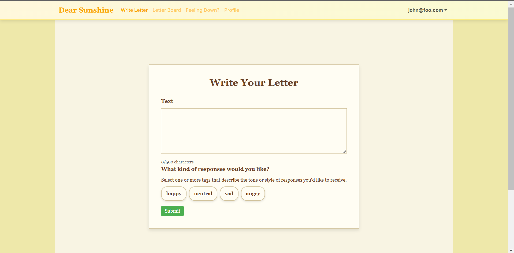

## Dear Sunshine

* [Overview](#overview)
* [Project Mockups](#project-mockups)
* [Project Milestones](#project-milestones)
* [User Guide](#user-guide)
* [Developer Guide](#developer-guide)
* [Deployment](#deployment)
* [Team](#team)
* [Contract](#contract)
* [Organization](#organization)
* [Guidelines](#guidelines)

## Overview

A platform where users can post letters to a "letter board" when they need encouragement or want to vent. The application allows others to respond to these letters, offering support and kindness. The goal is to create a friendly, uplifting environment that brightens someone's day.

Many people experience feelings of isolation or sadness and could benefit from positive, uplifting messages to brighten their day. While social media allows for sharing updates, it lacks a dedicated space where users can anonymously send and receive encouragement within a supportive community. Dear Sunshine addresses this gap by providing a platform where users can receive kind messages in response to what they've shared or vented about on the board.

## Project Mockups

  

    <h2>Home Page</h2>
    
  

<!-- 

        

          <h2>Home Page with Login</h2>
          
The main page displayed once the user is logged in. They will gain access to the other pages where they can write or read a letter.

          
        

      
 -->

  

    <h2>Write Letter</h2>
    
  

  

    <h2>Letter Board</h2>
    
    
  

  

    <h2>Mental Health Resources</h2>
    
  

  

    <h2>Profile</h2>
    
  

## Project Milestones
* [M1 Issues](https://github.com/orgs/dear-sunshine/projects/3)
* [M2 Issues](https://github.com/orgs/dear-sunshine/projects/4)
* [M3 Issues](https://github.com/orgs/dear-sunshine/projects/6)

## User Guide
We will guide users through the currently implemented functionality of the system through our currently the following screeenshots. 

navigate the profile page, where you can view your posts and replies, along with their respective counts. You can explore your posts and replies displayed in an organized layout, each with tags or timestamps to help you track your activity. Additionally, you can interact with features like editing your profile signature or viewing detailed insights, ensuring a user-friendly and personalized experience.

  

    <h2>Home Page</h2>
    
This is the main landing page of the site, where users can only access the sign-up or sign-in page to create a new account or log in to an existing one.

    
  

  

    <h2>Sign Up/Sign In</h2>
    
Here, users can either create a new account through the sign-up process or log in to an existing account to access the other pages.

    
    
  

  

    <h2>Sign Out</h2>
    
This page allows users to securely sign out of their account, ensuring their session is safely ended.

    
  

  

    <h2>Write Letter</h2>
    
On this page, users can compose their own letter and post it to the letter board for others to read and respond to. They can also add relevant tags to their posts to make it easier for others to find. The letter content is limited to 500 characters to encourage concise and meaningful messages.

    
  

  

    <h2>Letter Board</h2>
    
This page is a space where all users can view letter posts from themselves and others, and engage by replying to them. Users also have the ability to edit or delete their own posts, giving them full control over their content. To help find specific letters, a filter feature is available, allowing users to search for posts based on their preferences.

    
  

  

    <h2>Mental Health Resources</h2>
    
This page provides a collection of self-care tips and mental health resources to support users through life’s challenges. Users will find practical advice, like practicing gratitude, journaling, and taking mindful breaks, along with guidance on connecting with uplifting people and hobbies. For times when professional help is needed, the page lists helplines and directories to ensure users have access to immediate support and encouragement.

    
  

  

    <h2>Profile</h2>
    
This page allows users to view their posts and replies, along with their respective counts. Additionally, users can personalize their signature by replacing the default "Sunshine," which signs off posts with "From Sunshine" and replies with "Dear Sunshine."

    
  

## Developer Guide
1. [Install PostgreSQL](https://www.postgresql.org/download/).
2. Create a database for your application. $ createdb dear-sunshine
3. Go to [https://github.com/dear-sunshine/dear-sunshine](https://github.com/dear-sunshine/dear-sunshine). Click the "Use this template" button.
4. `cd` into the directory of your local copy of the repository and install third party libraries with `npm install`.
5. Create a `.env` file from the `sample.env`.
6. Run the Prisma migration `npx prisma migrate dev` to set up the PostgreSQL tables.
7. Seed the database with the `/config/settings.development.json` data using `npx prisma db seed`.
8. Run the app with `npm run dev`.
9. If all goes well, the template application will appear at [http://localhost:3000](http://localhost:3000).
    
## Deployment
* [Dear Sunshine](https://dearsunshine.vercel.app/)

## Team
Dear is designed, created and built by [Casey Caro](https://kmiks.github.io/), [Isabelle Castro](https://icastro808.github.io/), [Lucas Corriero](https://lucascorriero.github.io/) and [Tiffany Duong](https://tiffanyduong1.github.io/).

## Contract
[Our Contract](https://docs.google.com/document/d/18n-m7_Bmxgu_4VKnOa8Fqvjzj1smqy1n0AgkDyvxk6c/edit?tab=t.0).

## Organization
* [Dear Sunshine Organization](https://github.com/dear-sunshine)
* [Current Home Page's Repository](https://github.com/dear-sunshine/dear-sunshine.github.io/tree/main)
* [Project Page's Repository](https://github.com/dear-sunshine/dear-sunshine)

## Guidelines
* [Click here to see: Github Hosting Guidelines](https://courses.ics.hawaii.edu/ics314f24/morea/project-management/reading-guidelines-github-hosting.html)
 
Our team is committed to following the GitHub hosting guidelines to ensure a seamless and professional project development experience. We are hosting all essential source code within the repository, while avoiding "derived" files that can be generated locally, such as the node_modules directory. This is managed by utilizing a .gitignore file to exclude non-essential files. We have established a dedicated GitHub organization for our team-based development, where each member has "owner" status, ensuring equal collaboration and contribution. The project home page is maintained separately in a dear-sunshine.github.io repository using GitHub Pages, while the core application is developed in a distinct repository. Additionally, we are documenting our project thoroughly, including an overview, user guide, developer guide, and a detailed development history, adhering to the structured guidelines provided.
