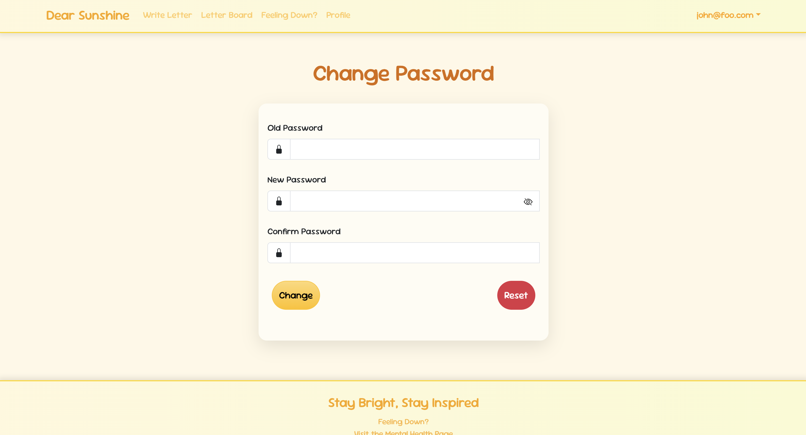

## Dear Sunshine

## Table of Contents
* [Overview](#overview)
* [Project Mockups](#project-mockups)
* [User Guide](#user-guide)
* [Developer Guide](#developer-guide)
* [Deployment](#deployment)
* [Project Milestones](#project-milestones)
* [Community Feedback](#community-feedback)
* [Team](#team)
* [Contract](#contract)
* [Organization](#organization)
* [Guidelines](#guidelines)

## Overview
Dear Sunshine is a program where users can post letters to a "letter board" when they need encouragement or want to vent. The application allows others to respond to these letters, offering support and kindness. The goal is to create a friendly, uplifting environment that brightens someone's day.

Many people experience feelings of isolation or sadness and could benefit from positive, uplifting messages to brighten their day. While social media allows for sharing updates, it lacks a dedicated space where users can anonymously send and receive encouragement within a supportive community. Dear Sunshine addresses this gap by providing a platform where users can receive kind messages in response to what they've shared or vented about on the board.

## Project Mockups

  

    <h2>Home Page</h2>
    
  

  

    <h2>Write Letter</h2>
    
  

  

    <h2>Letter Board</h2>
    
    
  

  

    <h2>Mental Health Resources</h2>
    
  

  

    <h2>Profile</h2>
    
  

## User Guide
We will guide users through the system's functionality using the following screenshots, accompanied by explanations of what can be accomplished on each page.

  

    <h2>Home Page</h2>
    
Users are provided an overview of the application and its purpose. For users who are not logged in, the page restricts access to most pages and features but still allows navigation to the Mental Health Resources page through the footer. Once a user logs in, the navigation bar updates, granting full access to other key pages of the site.

    
    
  

  

    <h2>Sign In and Sign Up</h2>
    
If users have already created an account, they can log in via the Sign In page by entering their email and password. New users must use the Sign Up page to create an account by providing their email and password. Once registered, users are automatically logged in and can access all features.

    
    
  

  

    <h2>Sign Out</h2>
    
Users are able to securely end their session. After signing out, users are automatically redirected to the Home Page to ensure a smooth exit experience.

    
  

  

    <h2>Change Password</h2>
    
Users can change their password by entering their current password and confirming the new password by typing it twice. This ensures security and accuracy when updating credentials.

    
  

  

    <h2>Write Letter</h2>
    
Users can compose their own letters to post onto the letter board. They must include relevant tags to help categorize the content and guide the type of responses they want to receive. Letters are also limited to 500 characters to encourage concise and meaningful communication.

    
  

  

    <h2>Letter Board</h2>
    
Displays all user letters and their replies, sorted chronologically and can be filtered by tags. Users can engage with the letters by replying with supportive or thoughtful messages or through reactions. They can also edit or delete their own letters, giving them full control over their content.

    
  

  

    <h2>Reply to Letter</h2>
    
Users will view the specific letter they’ve chosen to reply to and use the provided text box to compose their response. Replies are limited to 250 characters, ensuring they are concise and to the point.

    
  

  

    <h2>Mental Health Resources</h2>
    
Users will find a collection of self-care tips and mental health resources to support them through challenging times. It includes practical advice, such as practicing gratitude, journaling, and taking mindful breaks, as well as guidance on connecting with uplifting activities and people. The page also lists helplines and directories to ensure access to immediate professional support when needed.

    
  

  

    <h2>Profile</h2>
    
Users will be able to view and manage their posts and replies, along with counts for each. Users can also personalize their signature name by replacing the default "Sunshine," which signs off posts with "From Sunshine" and replies with "Dear Sunshine."

    
  

## Developer Guide
1. [Install PostgreSQL](https://www.postgresql.org/download/).
2. Create a database for your application. $ createdb dear-sunshine
3. Go to [https://github.com/dear-sunshine/dear-sunshine](https://github.com/dear-sunshine/dear-sunshine). Click the "Use this template" button.
4. `cd` into the directory of your local copy of the repository and install third party libraries with `npm install`.
5. Create a `.env` file from the `sample.env`.
6. Run the Prisma migration `npx prisma migrate dev` to set up the PostgreSQL tables.
7. Seed the database with the `/config/settings.development.json` data using `npx prisma db seed`.
8. Run the app with `npm run dev`.
9. If all goes well, the template application will appear at [http://localhost:3000](http://localhost:3000).
    
## Deployment
* [Dear Sunshine](https://dearsunshine.vercel.app/)

## Project Milestones
* [M1 Issues](https://github.com/orgs/dear-sunshine/projects/3)
* [M2 Issues](https://github.com/orgs/dear-sunshine/projects/4)
* [M3 Issues](https://github.com/orgs/dear-sunshine/projects/6)

## Community Feedback

## Team
Dear is designed, created and built by [Casey Caro](https://kmiks.github.io/), [Isabelle Castro](https://icastro808.github.io/), [Lucas Corriero](https://lucascorriero.github.io/) and [Tiffany Duong](https://tiffanyduong1.github.io/).

## Contract
* [Our Contract](https://docs.google.com/document/d/18n-m7_Bmxgu_4VKnOa8Fqvjzj1smqy1n0AgkDyvxk6c/edit?tab=t.0)

## Organization
* [Dear Sunshine Organization](https://github.com/dear-sunshine)
* [Current Home Page's Repository](https://github.com/dear-sunshine/dear-sunshine.github.io/tree/main)
* [Project Page's Repository](https://github.com/dear-sunshine/dear-sunshine)

## Guidelines
* [Github Hosting Guidelines](https://courses.ics.hawaii.edu/ics314f24/morea/project-management/reading-guidelines-github-hosting.html)  
Our team is committed to following the GitHub hosting guidelines to ensure a seamless and professional project development experience. We are hosting all essential source code within the repository, while avoiding "derived" files that can be generated locally, such as the node_modules directory. This is managed by utilizing a .gitignore file to exclude non-essential files. We have established a dedicated GitHub organization for our team-based development, where each member has "owner" status, ensuring equal collaboration and contribution. The project home page is maintained separately in a dear-sunshine.github.io repository using GitHub Pages, while the core application is developed in a distinct repository. Additionally, we are documenting our project thoroughly, including an overview, user guide, developer guide, and a detailed development history, adhering to the structured guidelines provided.